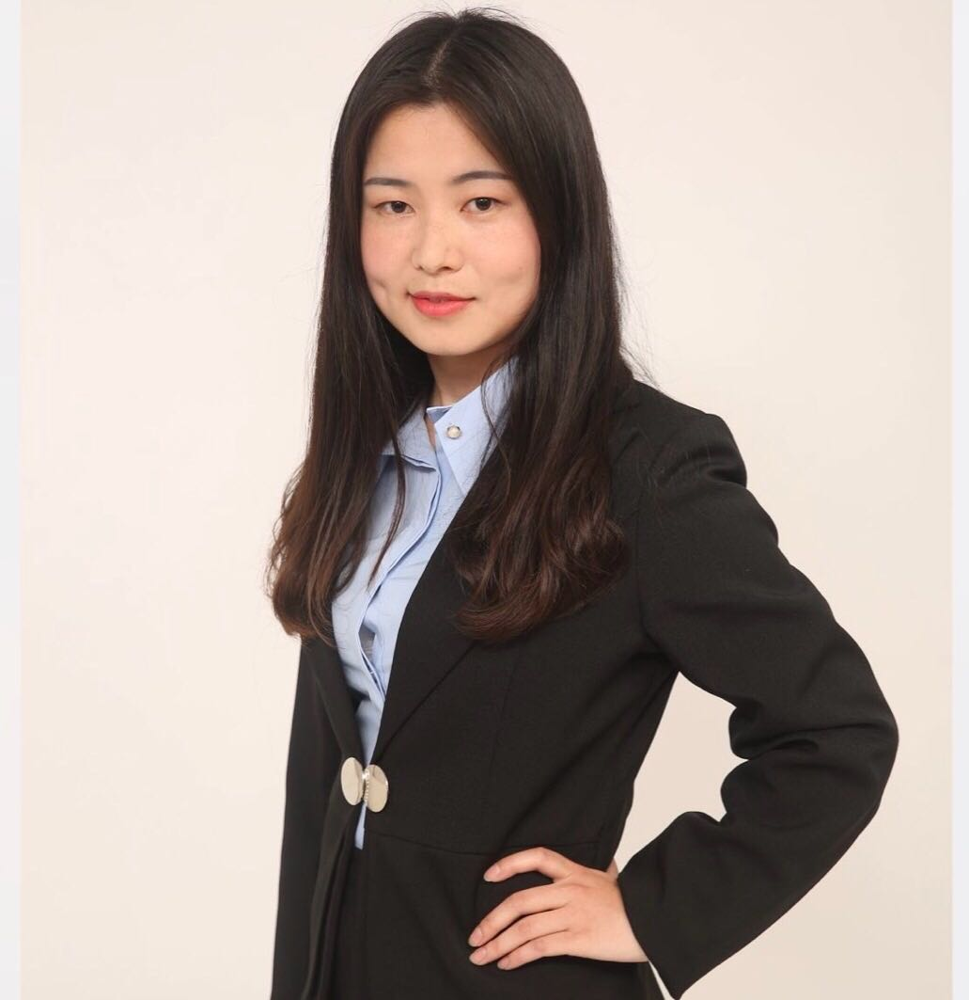

## About Me

I received my B.S. degree in 2013 and will receive the Ph.D degree in 2018, from the [Department of Computer Science and Technology](http://www.cs.ecnu.edu.cn/), [East China Normal University](http://www.ecnu.edu.cn). Before graduation, I worked as an International Visiting Research Trainee in the lab of [Information Retrieval and Knowledge Management](http://www.yorku.ca/jhuang/irlab/) in [York University](https://www.york.ac.uk/), Canada (2017.11-2018.02).
## Research

My research interests include information retrieval, natural language processing, and deep learning applied to text data. I have publications at top conferences and journals like AAAI, SIGIR, TKDE and TIST.

## Publications

- **Q. Chen**, Q. Hu, J. X. Huang, L. He. CA-RNN: using context-aligned recurrent neural networks for modeling sentence similarity. *In AAAI, 2018, 9 pages. (Top conference in Artificial Intelligence, CCF A, accepted)*
- **Q. Chen**, Q. Hu, J.X. Huang, L. He. TAKer: fine-grained time-aware microblog search with kernel density estimation. *TKDE, 2018, 14 pages. (Top journal in Database, CCF A, accepted)*
- **Q. Chen**, Q. Hu, J. X. Huang, L. He. CAN: Enhancing sentence similarity modeling with collaborative and adversarial network. *In SIGIR, 2018, 10 pages. (Top conference in Information Retrieval, CCF A, accepted)*
- **Q. Chen**, Q. Hu, J. X. Huang, L. He, W. An. Enhancing recurrent neural networks with positional attention for question answering. *In SIGIR, 2017, pages 993–996. (Top conference in Information Retrieval, CCF A)*
- **Q. Chen**, Q. Hu, J. X. Huang, L. He. Modeling queries with contextual snippets for information retrieval. *TIST, 2018, 9(4): 47:1–47:26.（Top journal, IF 3.19)*
- Q. Hu, J. Zhou, **Q. Chen**, L. He. SNNN: promoting word sentiment and negation in neural sentiment classification. *In AAAI, 2018, 8 pages. (Top conference in Artificial Intelligence, CCF A, accepted)*
- Q.Hu, Y.Pei, **Q.Chen**, L.He. SG++: word representation with sentiment and negation for twitter sentiment classification. *In SIGIR, 2016, pages 997–1000. (Top conference in Information Retrieval, CCF A)*
- W. An, **Q. Chen**, Y. Yang, L. He. Knowledge memory based lstm model for answer selection. *In ICONIP, 2017, pages 34–42.*
- X. Ouyang, Y. Yang, L. He, **Q. Chen**, J. Zhang. Representation learning with entity topics for knowledge graphs. *In KSEM, 2017, pages 534–542.*
- L. Chen, J. Zhou, L. He, **Q. Chen**, J. Zhang, Y. Yan. Modeling user-item profiles with neural networks for rating prediction. *In ICTAI, 2017, 8 pages.（accepted)*
- W. An, **Q. Chen**, W. Tao, J. Zhang, J. Yu, Y. Yang, Q. Hu, L. He, B. Li. *ECNU at 2017 LiveQA track: Learning question similarity with adapted long short-term memory networks. In TREC, 2017, pages 1-9.*
- **Q. Chen**, B. Wang, B. Huang, Q. Hu, L. He. ECNU at TREC 2015: Microblog track. *In TREC, 2015, pages 1-6.*
- **Q. Chen**, Q. Hu, Y. Pei, Y. Yang, L. He. ECNU at TREC 2014: Microblog track. *In TREC, 2014, pages 1-4.*
- **Q. Chen**, Y. Yang, Q. Hu, L. He. Locating query-oriented experts in microblog search. *In SIGIR Workshop on Semantic Matching in Information Retrieval, 2014, pages 16–23.*

## Patents
- Liang He (supervisor), Qin Chen et al. A method for improving social referral with user personality: China. NO. 2013102314494
- Liang He (supervisor), Qin Chen et al. A method of multi-level query expansion in Microblogs: China. NO. 2015102944375
- Liang He (supervisor), Qin Chen, Qinmin Hu. A method for query representation and hybrid retrieval based on context-aware topic modeling: China. NO. 2016106341742

## Awards & Honors
- **2018**: Outstanding Graduate in Shanghai, Outstanding Youth Scholarship
- **2017**: Student Travel Grant of SIGIR’17
- **2015**: Second Prize in National Contest of Mathematical Modeling for the Graduate Students
- **2014**: 5th place in international microblog search competition, i.e., TREC Microblog track (5/75)
- **2009-2013**: National Scholarship, National Encouragement Scholarship, Special Scholarship, First-Class Scholarship, Outstanding Graduate in East China Normal University
